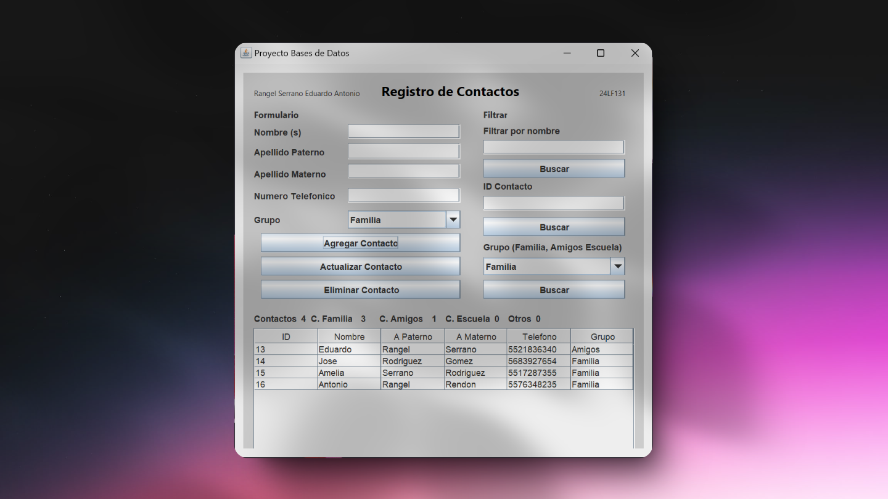

# Java registro de contactos por grupos

## Descripción

Este sistema tiene como objetivo almacenar y gestionar información básica de contactos personales, como amigos, familiares o compañeros de clase. Los usuarios podrán registrar, actualizar, eliminar y consultar información de los contactos, organizados por grupos (por ejemplo, "Amigos", "Familia", "Trabajo"). El sistema utiliza una base de datos MySQL y una interfaz sencilla de usuario desarrollada en Java.



## Estructura del Proyecto

El proyecto está compuesto por los siguientes archivos principales:

1. [**BasesDeDatospProyecto.java**](./src/main/java/com/mycompany/basesdedatospproyecto/BasesDeDatospProyecto.java): Es el punto de entrada principal de la aplicación. Este archivo inicializa la aplicación y coordina la interacción entre la base de datos y la interfaz de usuario.
2. [**MYSQL.java**](./src/main/java/com/mycompany/basesdedatospproyecto/MYSQL.java): Esta clase contiene los métodos para hacer peticiones a la base de datos MySQL utilizando JDBC. Aquí se gestionan las operaciones de inserción, actualización, eliminación y consultas.

3. [**Interfaz.java**](./src/main/java/com/mycompany/basesdedatospproyecto/Interfaz.java): Este archivo implementa la interfaz gráfica de usuario (GUI) utilizando JFrame. Permite a los usuarios interactuar con el sistema de forma sencilla y visual, proporcionando formularios para registrar contactos, actualizar datos y realizar consultas.

## Funcionalidades

El sistema permite las siguientes operaciones:

- **Registrar un nuevo contacto**: Permite ingresar todos los datos de contacto junto con el grupo al que pertenece.
- **Actualizar información de un contacto**: Permite modificar datos como el número de teléfono, el correo electrónico, etc.
- **Eliminar un contacto**: Elimina un registro de la base de datos.
- **Consultar contactos por grupo**: Permite consultar los contactos filtrando por el grupo al que pertenecen.

### Requisitos previos

Antes de comenzar, asegúrate de tener instalado:

- Java (JDK 8 o superior)
- MySQL

### Dependencias

Para instalar la dependencia de JDBC (MySQL Connector) automáticamente, agrega la siguiente línea en el archivo [`pom.xml`](./pom.xml) de tu proyecto:

```xml
<dependencies>
    <!-- Dependencia para MySQL JDBC Driver -->
    <dependency>
        <groupId>mysql</groupId>
        <artifactId>mysql-connector-java</artifactId>
        <version>8.0.33</version> <!-- Asegúrate de que sea la versión actual -->
    </dependency>
</dependencies>
```

## Creación de la Base de Datos y Tablas

### Paso 1: Crear la Base de Datos

Para crear la base de datos `contactosdb`, ejecuta el siguiente comando en tu consola de MySQL:

```sql
CREATE DATABASE contactosdb;
```

Este comando crea una nueva base de datos llamada `contactosdb` en MySQL.

### Paso 2: Seleccionar la Base de Datos

Una vez que hayas creado la base de datos, debes seleccionarla para trabajar con ella:

```sql
USE contactosdb;
```

Esto asegura que todas las operaciones siguientes se realicen en la base de datos `contactosdb`.

### Paso 3: Crear la Tabla `grupos`

La tabla `grupos` almacena las categorías a las que pueden pertenecer los contactos. Utiliza el siguiente comando para crearla:

```sql
CREATE TABLE grupos (
    idGrupo INT AUTO_INCREMENT PRIMARY KEY,
    nombreGrupo VARCHAR(50) NOT NULL
);
```

**Explicación**:

- `idGrupo`: Es la clave primaria de la tabla, que se autoincrementa con cada nuevo grupo.
- `nombreGrupo`: Es un campo de texto que almacena el nombre del grupo (como "Familia", "Amigos", etc.). No puede ser nulo.

### Paso 4: Crear la Tabla `contactos`

La tabla `contactos` almacena los detalles de cada contacto, incluyendo su información personal y el grupo al que pertenece. Usa el siguiente comando para crearla:

```sql
CREATE TABLE contactos (
    idContacto INT AUTO_INCREMENT PRIMARY KEY,
    nombre VARCHAR(50) NOT NULL,
    apellidoPaterno VARCHAR(50) NOT NULL,
    apellidoMaterno VARCHAR(50) NOT NULL,
    telefono VARCHAR(15),
    idGrupo INT,
    FOREIGN KEY (idGrupo) REFERENCES grupos(idGrupo)
);
```

**Explicación**:

- `idContacto`: Es la clave primaria de la tabla, que se autoincrementa con cada nuevo contacto.
- `nombre`: Almacena el nombre del contacto.
- `telefono`: Almacena el número de teléfono del contacto (opcional).
- `idGrupo`: Es una clave foránea que hace referencia a la tabla `grupos`. Esto indica el grupo al que pertenece el contacto.
- `apellidoPaterno`: Almacena el apellido paterno del contacto.
- `apellidoMaterno`: Almacena el apellido materno del contacto.

### Paso 5: Insertar Datos en la Tabla `grupos`

Para agregar los grupos predeterminados, usa el siguiente comando de inserción:

```sql
INSERT INTO grupos (nombreGrupo)
VALUES
    ('Familia'),
    ('Amigos'),
    ('Escuela'),
    ('Otros');
```

Este comando inserta los cuatro grupos: "Familia", "Amigos", "Escuela" y "Otros" en la tabla `grupos`.

### Resumen de los Comandos

```sql
CREATE DATABASE contactosdb;

USE contactosdb;

CREATE TABLE grupos (
    idGrupo INT AUTO_INCREMENT PRIMARY KEY,
    nombreGrupo VARCHAR(50) NOT NULL
);

CREATE TABLE contactos (
    idContacto INT AUTO_INCREMENT PRIMARY KEY,
    nombre VARCHAR(50) NOT NULL,
    telefono VARCHAR(15),
    idGrupo INT,
    apellidoPaterno VARCHAR(50) NOT NULL,
    apellidoMaterno VARCHAR(50) NOT NULL,
    FOREIGN KEY (idGrupo) REFERENCES grupos(idGrupo)
);

INSERT INTO grupos (nombreGrupo)
VALUES
    ('Familia'),
    ('Amigos'),
    ('Escuela'),
    ('Otros');

SHOW TABLES;
DESCRIBE grupos;
DESCRIBE contactos;
SELECT * FROM grupos;
```

## Clase [MYSQL](./src/main/java/com/mycompany/basesdedatospproyecto/MYSQL.java).

La clase [MYSQL.java](./src/main/java/com/mycompany/basesdedatospproyecto/MYSQL.java) es la encargada de gestionar las operaciones de la base de datos, incluyendo la conexión, la inserción, la actualización y la eliminación de registros. Aquí están definidas las funciones más importantes.

### Funciones de Conexión

1. **`conectar()`**:  
   Esta función establece la conexión con la base de datos MySQL utilizando las credenciales necesarias (usuario y contraseña). Se asegura de que la aplicación pueda comunicarse con la base de datos para realizar consultas y modificaciones. Devuelve una conexión activa que se usará para realizar operaciones sobre la base de datos.

2. **`cerrarConexion()`**:  
   Esta función cierra la conexión establecida con la base de datos. Es importante invocar esta función al finalizar el trabajo con la base de datos para liberar recursos y evitar conexiones abiertas innecesarias, lo que podría causar problemas de rendimiento o de acceso a la base de datos.

### Funciones de Manipulación de Datos

3. **`insertarValores()`**:  
   Permite insertar un nuevo contacto en la base de datos. Acepta parámetros como el nombre, teléfono, grupo, y apellidos del contacto. Utiliza una sentencia `INSERT` para agregar los datos a la tabla de contactos, creando un nuevo registro en la base de datos.

4. **`actualizarContacto()`**:  
   Actualiza la información de un contacto específico. Dado un ID de contacto, permite modificar los datos de ese contacto, como el nombre, teléfono y apellidos. Es útil cuando se necesita corregir o cambiar los detalles de un contacto ya registrado en el sistema.

5. **`eliminarContacto()`**:  
   Elimina un contacto de la base de datos, identificado por su ID. Esta función ejecuta una sentencia `DELETE`, removiendo completamente el registro del contacto de la tabla. Es útil cuando un contacto ya no es necesario o se ha registrado incorrectamente.

### Funciones de Consulta de Datos

6. **`obtenerContactosSimilaresPorNombre()`**:  
   Busca y devuelve todos los contactos cuyo nombre coincida parcialmente con el parámetro ingresado. Utiliza una consulta con un `LIKE` en SQL, permitiendo encontrar contactos por nombre de manera flexible. Es útil para buscar contactos cuando se conoce solo una parte de su nombre.

7. **`obtenerContactosSimilaresPorId()`**:  
   Obtiene todos los contactos que pertenecen a un grupo específico, identificado por el ID de grupo. Este método permite filtrar los contactos por el grupo al que pertenecen (por ejemplo, "Amigos", "Familia", etc.), facilitando la consulta de contactos dentro de una categoría.

8. **`obtenerContactosPorIdGrupo()`**:  
   Esta función obtiene todos los contactos que están en un grupo específico. Retorna los nombres completos de los contactos, permitiendo al usuario ver todos los miembros de un grupo determinado. Es útil cuando se desea consultar todos los miembros de una categoría específica de contactos.

9. **`obtenerContactos()`**:  
   Retorna una lista de todos los contactos registrados en la base de datos, mostrando su nombre completo. Esta función permite obtener un listado completo de contactos sin filtro, lo cual es útil para tener una visión general de todos los contactos registrados.

10. **`obtenerContactoPorId()`**:  
    Permite obtener un único contacto dado su ID. Esta función es útil para consultar la información detallada de un contacto específico, como su nombre, apellidos y grupo al que pertenece.

11. **`obtenerNombreGrupo()`**:  
    Esta función obtiene el nombre de un grupo dado su ID. Es útil para mostrar el nombre del grupo al que pertenece un contacto, ya que permite recuperar la categoría de un grupo, como "Amigos" o "Familia", según el ID.

### Funciones de Contabilización de Datos

12. **`contarElementosContactos()`**:  
    Cuenta el número total de contactos registrados en la base de datos. Esta función devuelve la cantidad total de contactos sin importar su grupo, proporcionando una visión general del tamaño de la base de datos de contactos.

13. **`contarElementosContactosPorGr()`**:  
    Similar a la función anterior, pero esta función cuenta solo los contactos que pertenecen a un grupo específico. Dado un ID de grupo, devuelve la cantidad de contactos registrados dentro de ese grupo, lo que permite conocer cuántos miembros tiene un grupo en particular.

Estas funciones juntas permiten que el sistema gestione los contactos de manera dinámica y flexible, proporcionando una base robusta para operaciones de CRUD (Crear, Leer, Actualizar, Eliminar) en una base de datos relacional.
